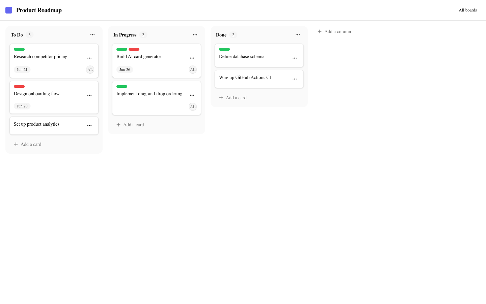
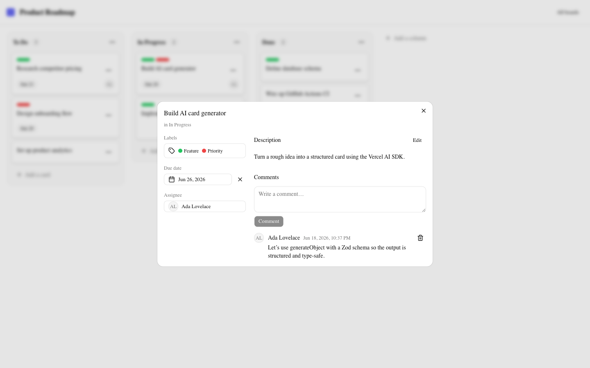
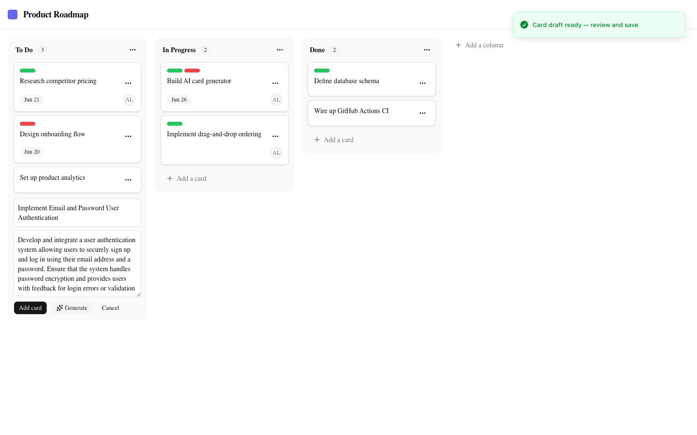

# Kanban Board AI

[](https://github.com/febbryandika/kanban-board/actions/workflows/ci.yml)

A drag-and-drop Kanban board (Trello-style) with **AI-assisted card generation**. Create boards, columns, and cards; drag them around with optimistic updates; share boards with teammates by email; and turn a rough idea into a structured card with one click.

Built as a single **Next.js 16 fullstack** app — App Router, Route Handlers, and Server Actions in one deployable, no separate API server.

## Screenshots



| Card detail modal | AI card generator |
| --- | --- |
|  |  |

_Card modal: labels, due date, assignee, Markdown description, and comments. AI generator: a rough idea becomes a draft title + description for review (it never auto-creates the card)._

## Features

- 🔐 **Auth** — email/password via Better Auth, with rate-limited sign-in
- 📋 **Boards** — create, rename, delete (owner only), background color
- 👥 **Async sharing** — invite members by email, `owner` / `member` roles, leave or remove members (no realtime — changes appear on refetch)
- 🗂️ **Columns** — create, rename inline, delete (cascades cards), drag to reorder
- 🃏 **Cards** — title, Markdown description, due date, assignee, labels, and archive (soft delete)
- 🖱️ **Drag & drop** — cards across columns and column reordering, optimistic with rollback; only the moved row is written (O(1) via fractional indexing)
- 🏷️ **Labels** — per-board, 8 preset colors, toggle on/off cards
- 💬 **Comments** — per card; author or board owner can delete
- ✨ **AI card generator** — a rough idea → `{ title, description, acceptanceCriteria }` that pre-fills the add-card form for review

## Tech Stack

| Layer | Technology |
| --- | --- |
| Framework | Next.js 16 (App Router) — fullstack, single deployable |
| UI | React 19 · Tailwind CSS v4 · shadcn/ui · lucide · sonner |
| Server state | TanStack Query v5 (optimistic drag-and-drop + rollback) |
| Client state | Zustand v5 (card modal / drag UI state) |
| Drag and drop | @dnd-kit/core · @dnd-kit/sortable · fractional-indexing |
| Auth | Better Auth (email/password, DB-backed rate limiting) |
| Database | Neon PostgreSQL · Drizzle ORM · drizzle-kit |
| Validation | Zod v4 (schemas shared across server + client) |
| AI | Vercel AI SDK (`ai` + `@ai-sdk/openai`, `gpt-4.1-mini`) |
| Tooling | pnpm · TypeScript · ESLint · Prettier · Vitest · Playwright · GitHub Actions |

## Architecture



The app deliberately uses **two server-mutation patterns**:

- **Route Handlers** (`src/app/api/**`) serve board reads and *interactive* mutations (card/column create, move, archive, comments, labels). They're consumed by **TanStack Query** hooks so drag-and-drop gets optimistic updates with rollback.
- **Server Actions** (`src/actions/**`) handle *form-style* mutations (create/rename/delete board, member management, label CRUD). Each validates with Zod, checks membership/ownership, then `revalidatePath`.

A few principles run throughout:

- **Membership-gated** — every board/column/card/comment mutation calls `requireMember(boardId)`; owner-only actions add `requireOwner`. There are **no public boards**.
- **Async, not realtime** — members share a board and changes appear on refetch. No WebSocket/live presence — which is exactly why this is Next.js fullstack and not React + a separate API server.
- **Fractional indexing** — `sortOrder` is a string key (`generateKeyBetween`); a drag writes only the moved row, never renumbering siblings.

See **[docs/API.md](docs/API.md)** for the full endpoint + Server Action reference.

## Project Structure

```
src/
├── app/
│   ├── (app)/boards/         # board list + new board (auth-gated)
│   ├── board/[id]/           # kanban view (DnD, client)
│   ├── login/ · signup/      # Better Auth forms
│   ├── api/                  # Route Handlers (boards, columns, cards, comments, labels, ai)
│   ├── providers.tsx         # TanStack Query provider
│   └── error.tsx             # root error boundary
├── actions/                  # Server Actions (board, label)
├── components/
│   ├── board/                # KanbanBoard, BoardColumn, CardItem, CardModal, ...
│   ├── boards/               # board list, members dialog, create/rename/delete
│   └── ui/                   # shadcn/ui primitives
├── hooks/                    # TanStack Query hooks (useBoard, useMoveCard, ...)
├── stores/ui.ts              # Zustand UI store (active card)
├── db/                       # Drizzle schema (app + Better Auth) + client
├── lib/                      # auth, validations (Zod), fractional, ratelimit, logger, env
└── types/                    # shared board payload types
e2e/                          # Playwright specs
drizzle/                      # generated SQL migrations
docs/                         # API, database, diagrams, screenshots
```

## Local Setup

**Prerequisites:** Node.js 20+, [pnpm](https://pnpm.io), a free [Neon](https://neon.tech) Postgres database, and an [OpenAI API key](https://platform.openai.com) (for the AI feature).

```bash
# 1. Install
git clone https://github.com/febbryandika/kanban-board.git
cd kanban-board
pnpm install

# 2. Configure environment
cp .env.example .env.local      # then fill in the values (see below)

# 3. Apply the schema to your Neon database
pnpm db:migrate

# 4. Run the dev server
pnpm dev
```

Open [http://localhost:3000](http://localhost:3000), create an account, and start a board.

> **Tip:** Use a dedicated Neon **branch** for local development and keep `production` for the deployed app — Neon branches are instant and free, so schema changes never touch production data.

**Scripts**

| Command | Purpose |
| --- | --- |
| `pnpm dev` | Dev server |
| `pnpm build` | Production build (also the typecheck gate) |
| `pnpm lint` / `pnpm typecheck` | ESLint / `tsc --noEmit` |
| `pnpm test` | Vitest unit tests |
| `pnpm test:e2e` | Playwright E2E (needs a dev server) |
| `pnpm db:generate` / `pnpm db:migrate` | Generate / apply Drizzle migrations |
| `pnpm db:studio` | Drizzle Studio |

## Environment Variables

| Variable | Description |
| --- | --- |
| `DATABASE_URL` | Neon Postgres connection string |
| `BETTER_AUTH_SECRET` | Session secret, 32+ chars — generate with `openssl rand -base64 32` |
| `BETTER_AUTH_URL` | App base URL (e.g. `http://localhost:3000`) |
| `OPENAI_API_KEY` | OpenAI key for AI card generation |
| `LOG_LEVEL` | _(optional)_ `debug` \| `info` \| `warn` \| `error` |

Values are validated at build time with `@t3-oss/env-nextjs`, so a missing or malformed variable fails the build fast. See [`.env.example`](.env.example) for the template.

## Database Schema



Seven application tables — `boards`, `board_members`, `columns`, `labels`, `cards`, `card_labels`, `comments` — plus an `ai_rate_limits` table and the Better Auth tables. IDs are cuid2 strings; `sortOrder` is a fractional-indexing string; cards soft-delete via `is_archived`. Cascade deletes flow board → columns/labels/members → cards → card_labels/comments.

Full table-by-table reference: **[docs/DATABASE.md](docs/DATABASE.md)**.

## Testing

- **Vitest** (`src/**/*.test.ts`) — fractional-index ordering, the optimistic-move reducers, membership/ownership helpers, validation schemas, and the AI output schema.
- **Playwright** (`e2e/`) — login, create board → column → card → drag (persists after reload), AI generate pre-fill, and a non-member being blocked.
- **CI** ([`.github/workflows/ci.yml`](.github/workflows/ci.yml)) runs lint · typecheck · Vitest on every push/PR to `main` (Node 22). E2E runs locally on demand.

## Deployment (Vercel + Neon)

1. **Neon** — create a project; copy the pooled connection string. Use one branch for production and a separate branch for local dev.
2. **Vercel** — import the repo. Set the four required env vars (point `BETTER_AUTH_URL` at the deployed domain, `DATABASE_URL` at the Neon production branch). The default `next build` command applies; env validation runs at build time.
3. **Migrations** — run `pnpm db:migrate` against the production `DATABASE_URL` before (or as part of) a release.

## Future Improvements

- Real-time presence (WebSocket) for live multiplayer
- Card attachments / file uploads
- Full-text search across cards
- Email notifications for invitations and due-date reminders
- Recurring due dates and a calendar view
- Activity log / audit trail per board
- An archived-cards view with restore
